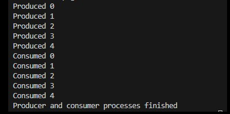
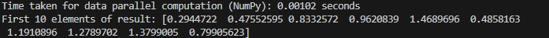
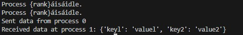
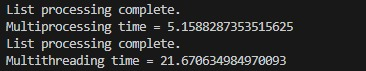

Concurrency and Parallelism in Python
Python programs showcasing different aspects of concurrency, parallelism, and GPU computing.

Table of Contents
Multiprocessing and Multithreading
Semaphore for Thread Synchronization
Vector Addition with ThreadPoolExecutor
Calculating Fibonacci with Threads
GPU Computing with CUDA
Data Parallelism with NumPy
Thread Synchronization for Bank Transactions
MPI for Distributed Computing
Multiprocessing for Square and Cube Calculations
Producer-Consumer Model with Multiprocessing

Multiprocessing and Multithreading
Code Overview:
Demonstrates processing a large list using multiprocessing and multithreading.
Compares execution times for both approaches.
Key Concepts:
multiprocessing.Process
threading.Thread
Example Usage:
python multiprocessing_and_multithreading.py
Semaphore for Thread Synchronization

Code Overview:
Uses a semaphore to manage access to a shared resource.

Key Concepts:
threading.Semaphore

Example Usage:
python semaphore_example.py

Vector Addition with ThreadPoolExecutor

Code Overview:
Performs vector addition in parallel using ThreadPoolExecutor.

Key Concepts:
concurrent.futures.ThreadPoolExecutor
Slicing arrays for parallel computation

Example Usage:

python vector_add_threadpool.py
Calculating Fibonacci with Threads

Code Overview:
Spawns multiple threads to compute Fibonacci numbers.

Key Concepts:
Recursive functions
threading.Thread

Example Usage:
python fibonacci_threads.py

GPU Computing with CUDA

Code Overview:
Uses Numba and CUDA to perform parallel vector addition on the GPU.

Key Concepts:
numba.cuda
Thread and block configurations

Example Usage:

python gpu_vector_addition.py
Data Parallelism with NumPy

Code Overview:
Performs vector addition using NumPy for efficient computation.
Key Concepts:
Array operations in NumPy

Example Usage:
python numpy_parallelism.py
Thread Synchronization for Bank Transactions

Code Overview:
Uses a lock to synchronize deposit and withdraw operations.
Key Concepts:
threading.Lock
Critical sections

Example Usage:

python bank_transactions.py
MPI for Distributed Computing

Code Overview:
Demonstrates inter-process communication using MPI with mpi4py.
Key Concepts:
MPI.COMM_WORLD
comm.send and comm.recv

Example Usage:

mpiexec -n 2 python mpi_example.py
Multiprocessing for Square and Cube Calculations

Code Overview:
Demonstrates multiprocessing to calculate squares and cubes of numbers.

Key Concepts:
multiprocessing.Process

Example Usage:
python multiprocessing_calculations.py
Producer-Consumer Model with Multiprocessing

Code Overview:
Implements a producer-consumer model using a shared queue.

Key Concepts:
multiprocessing.Queue
Process for producer and consumer tasks

Example Usage:
python producer_consumer.py
Requirements
Python 3.8+
Libraries:
NumPy
Numba
mpi4py
Installation
To install required dependencies:

pip install numpy numba mpi4py
Notes
Ensure you have CUDA installed for GPU-based examples.
Use an MPI implementation (e.g., OpenMPI) for running MPI examples.
License
This repository is licensed under the MIT License. Feel free to use and modify the code.

  
    
