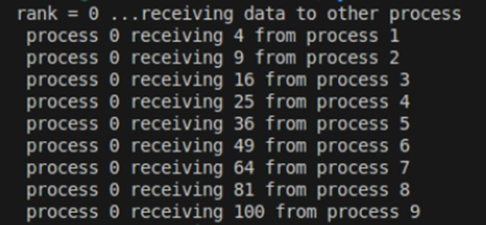
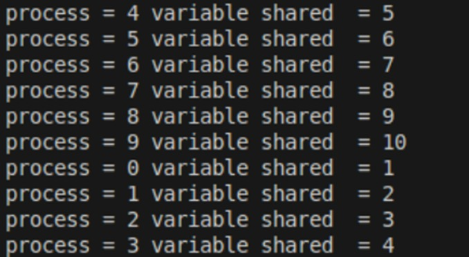
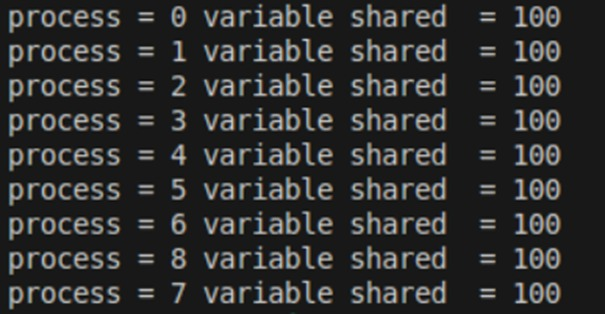
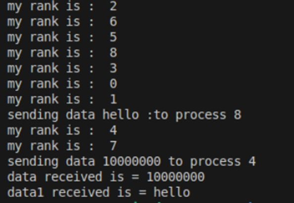

MPI Programming Examples with mpi4py
This repository contains Python scripts that demonstrate parallel programming using the MPI (Message Passing Interface) with the mpi4py library. These examples showcase various MPI communication methods such as send, receive, broadcast, scatter, and gather.

Table of Contents
Point-to-Point Communication
Broadcast Communication
Scatter Communication
Gather Communication

1. Point-to-Point Communication
   File: point_to_point.py
   Description: Demonstrates sending and receiving data between processes using comm.send and comm.recv.

Key Features:

Process 0 sends data to Process 4.
Process 1 sends data to Process 8.
Processes 4 and 8 receive data from Processes 0 and 1, respectively. 2. Broadcast Communication
File: broadcast_example.py
Description: A root process shares a single variable with all other processes using comm.bcast.

Key Features:

Process 0 broadcasts a variable to all other processes.
Ensures every process receives the same data. 3. Scatter Communication
File: scatter_example.py
Description: Distributes elements of an array from a root process to all processes using comm.scatter.

Key Features:

Process 0 scatters an array among all processes.
Each process receives a unique element from the array. 4. Gather Communication
File: gather_example.py
Description: Gathers data from all processes to the root process using comm.gather.

Key Features:

Each process computes a unique value based on its rank.
Process 0 gathers the computed values from all processes.
How to Run the Examples
Install mpi4py:
pip install mpi4py

Requirements
Python 3.x
mpi4py library
MPI implementation (e.g., OpenMPI, MPICH)
Concepts Demonstrated
Point-to-Point Communication: Direct data exchange between processes.
Collective Communication: Operations that involve all processes in a communicator, such as broadcast, scatter, and gather.
Process Synchronization: Using comm.Barrier() to ensure processes are synchronized.

   
